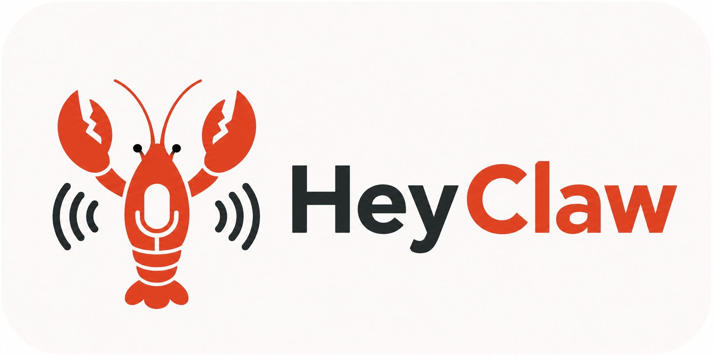
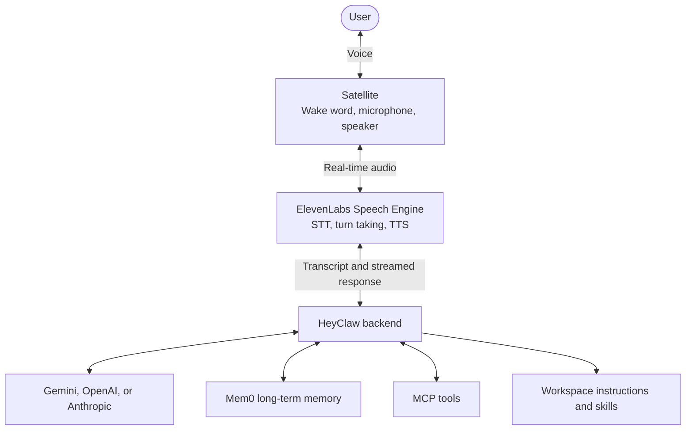
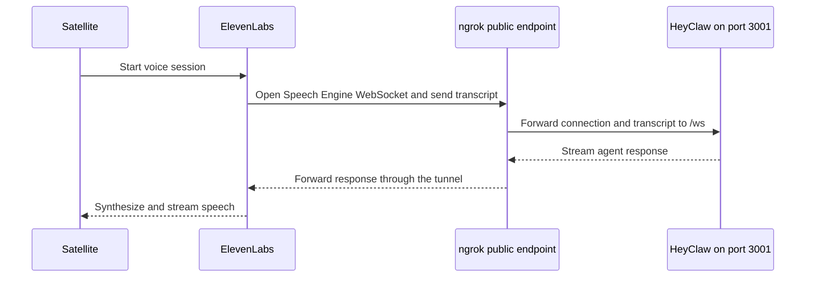

<p align="center">
  
</p>

---

# HeyClaw 🦞

**A lightweight, open-source, voice-first personal AI agent.**

HeyClaw listens locally for a wake word, opens a real-time voice session, and connects speech to a small, readable Python agent powered by your choice of Gemini, OpenAI, or Anthropic, plus Mem0, MCP tools, and workspace skills. It keeps the device-facing audio path separate from the agent backend, so the intelligence can run remotely while each room only needs a lightweight satellite.

## Why HeyClaw

- **Voice first:** wake word, microphone input, streamed responses, and interruption-aware speech are the primary interface.
- **Small, readable core:** the agent loop is intentionally compact and avoids a large orchestration framework.
- **Persistent memory:** Mem0 retrieves relevant user context and stores durable details across conversations.
- **Tool ready:** MCP servers provide external capabilities, while workspace skills define when and how the agent may use them.
- **Self-hosted orchestration:** the backend, prompts, workspace, tools, and configuration remain under your control.
- **Satellite architecture:** audio capture and wake-word detection are isolated from the backend and ready to move onto dedicated hardware.

## What HeyClaw can do

HeyClaw currently provides:

- local wake-word detection with openWakeWord;
- real-time speech-to-text and text-to-speech through ElevenLabs Speech Engine;
- configurable Gemini, OpenAI, or Anthropic language models through DSPy;
- a DSPy ReAct agent with dynamically discovered MCP tools;
- long-term, user-scoped semantic memory through Mem0;
- runtime instructions, identity, user profile, and skills loaded from a local workspace;
- a FastAPI service for health and readiness checks;
- separate backend and satellite Python packages.

## 🏗️ How it fits together



The repository contains two independent Python projects:

- `heyclaw/` contains FastAPI, the ElevenLabs Speech Engine server, DSPy, Gemini/OpenAI/Anthropic integrations, Mem0, MCP integration, and the runtime workspace.
- `satellite/` contains local audio, echo handling, openWakeWord detection, and the ElevenLabs conversation client.

ElevenLabs handles the speech layer. When a user finishes speaking, it sends the transcript to HeyClaw's public WebSocket endpoint. HeyClaw retrieves relevant memories, lets the model use applicable skills and MCP tools, and streams the final text back for speech synthesis.

## Requirements

Both platforms require Python 3.12, `uv`, GNU Make, `ngrok`, and working microphone and speaker devices.

- Linux and WSL additionally require `lsof`.
- Native Windows requires PowerShell 7 with `pwsh.exe` available in `PATH`.

Linux and WSL use `Makefile`. Native Windows uses the separate `Makefile.windows`, which delegates process management to `heyclaw/scripts/dev.ps1`.

## ngrok CLI

HeyClaw runs its Speech Engine WebSocket server locally on port 3001, but ElevenLabs must be able to connect to it from the public Internet. ngrok provides the public `wss://` endpoint that forwards traffic to the local server without router configuration.

1. Create or sign in to an ngrok account.
2. Open the official [ngrok CLI setup page](https://dashboard.ngrok.com/get-started/setup).
3. Select your operating system and follow the displayed installation instructions.
4. Add the authentication token shown by the dashboard to the CLI configuration.
5. Ensure `ngrok` is available in `PATH`. The platform-specific `backend` target starts and supervises the configured tunnel automatically.

The Makefile reads `gateway.publicWsUrl` from `heyclaw/config.json`, validates that it is a `wss://` URL ending in `/ws`, and gives its hostname to ngrok.



This connection model follows the official [ElevenLabs Speech Engine documentation](https://elevenlabs.io/docs/eleven-api/guides/cookbooks/speech-engine): ElevenLabs performs speech recognition and synthesis, while HeyClaw supplies the LLM, memory, skills, and tool logic.

## 🔑 Configuration

After installing the dependencies, create or refresh both JSON configuration files
with the satellite CLI:

```bash
uv run --project satellite heyclaw-satellite onboard
```

`onboard` never replaces configured values. It creates missing files from their
examples, adds fields introduced by newer versions, and fills unset audio device
indices only when PortAudio can make a conservative recommendation. Existing API
keys, IDs, model choices, and audio selections are preserved.

After connecting a different microphone or output device, refresh only the audio
selection while preserving every other setting. In an interactive terminal,
`onboard` presents the connected input and output devices as selectable lists:

```bash
uv run --project satellite heyclaw-satellite onboard --update-audio
```

If Windows keeps the old defaults after you connect new hardware, list the current
PortAudio indices and select the new endpoints explicitly:

```bash
uv run --project satellite heyclaw-satellite devices
uv run --project satellite heyclaw-satellite onboard --update-audio --input-device-index 2 --output-device-index 4
```

### Echo suppression modes

`defaults.agent.echoSuppressionMode` controls how satellite playback is kept out
of the microphone stream:

- `off` keeps full-duplex audio and performs no software suppression. Use it with
  headphones or a speakerphone that exposes a matching hardware echo-cancelled
  input/output pair. With ordinary speakers, playback can be transcribed as a new
  user turn and trigger loops.
- `gate` closes the microphone while the assistant is speaking and for
  `echoGuardMs` afterward. It is the safest default for separate speakers, at the
  cost of preventing the user from interrupting playback.
- `aec` runs software acoustic echo cancellation using the playback stream as its
  reference. It keeps interruption possible, but results depend on device and
  driver timing; use it only after a real speaker test.

`agc` (automatic gain control) is a different audio process and is not a supported
`echoSuppressionMode` value.

Prepare the logging environment files separately:

- `heyclaw/.env` from `heyclaw/.env.example`;
- `satellite/.env` from `satellite/.env.example`;

The `.env` files contain logging settings only. Provider credentials, agent defaults, audio settings, memory, and MCP servers belong in the corresponding `config.json` files.

### ElevenLabs

1. Sign in to ElevenLabs and open the [API Keys page](https://elevenlabs.io/app/api/api-keys).
2. Create an API key.
3. Set `providers.elevenlabs.elevenlabsApiKey` in both `heyclaw/config.json` and `satellite/config.json`.
4. Set `gateway.publicWsUrl` in `heyclaw/config.json` to your public secure WebSocket endpoint ending in `/ws`.
5. Create an ElevenLabs Speech Engine connected to that WebSocket URL by following the official [Speech Engine quickstart](https://elevenlabs.io/docs/eleven-api/guides/cookbooks/speech-engine).
6. Copy the resulting `seng_...` identifier into `providers.elevenlabs.elevenlabsSpeechEngineId` in both configuration files.

The API key and Speech Engine ID must match across the backend and satellite.

### Language model provider

Select the hosted LLM with `defaults.agent.llmProvider`, set its model in `defaults.agent.llmModel`, and add only the matching API key under `providers`.

| Provider | `llmProvider` | Example `llmModel` | API key setting |
|---|---|---|---|
| Google Gemini | `gemini` | `gemini-3.1-flash-lite` | `providers.gemini.geminiApiKey` |
| OpenAI | `openai` | `gpt-5.6-luna` | `providers.openai.openaiApiKey` |
| Anthropic | `anthropic` | `claude-sonnet-5` | `providers.anthropic.anthropicApiKey` |

Gemini remains the default. Create credentials in [Google AI Studio](https://aistudio.google.com/app/api-keys), the [OpenAI API platform](https://platform.openai.com/api-keys), or the [Anthropic Console](https://console.anthropic.com/settings/keys). Model names may be written with or without their matching DSPy provider prefix, for example `gpt-5.6-luna` or `openai/gpt-5.6-luna`.

For real-time voice use, the current recommended choices are:

- **OpenAI:** `gpt-5.6-luna` for the lowest latency and cost, `gpt-5.6-terra` for a balanced option, or `gpt-5.6-sol` for maximum capability;
- **Anthropic:** `claude-sonnet-5` for the best general balance, `claude-opus-5` for maximum capability, or `claude-haiku-4-5-20251001` when latency and cost matter most.

Some current reasoning models accept only their default temperature. HeyClaw detects these model families and omits `llmTemperature` automatically while continuing to use the configured value for models that support it.

To switch to OpenAI, for example:

```json
{
  "defaults": {
    "agent": {
      "llmProvider": "openai",
      "llmModel": "gpt-5.6-luna"
    }
  },
  "providers": {
    "openai": {
      "openaiApiKey": "your_key_here"
    }
  }
}
```

### Mem0

1. Sign in to the [Mem0 API Keys dashboard](https://app.mem0.ai/dashboard/api-keys).
2. Create a platform API key.
3. Store it as `defaults.memory.mem0.apiKey` in `heyclaw/config.json`.

Mem0 is the agent's persistent memory layer. HeyClaw searches user-scoped memories before answering and stores only durable user information after a conversation.

### Perplexity web search

1. Sign in to the [Perplexity API Console](https://console.perplexity.ai/group/keys).
2. Create an API group if your account does not already have one.
3. Generate an API key and save it when it is displayed; Perplexity does not show the complete key again.
4. Replace `your_key_here` at `tools.mcpServers.perplexity.env.PERPLEXITY_API_KEY` in `heyclaw/config.json`.

The configured Perplexity MCP server gives the web-search skill access to current information.

## 🚀 Quick start

### Linux and WSL

Install Python dependencies for both components from the repository root:

```bash
make setup
```

Start the backend, Speech Engine, and ngrok tunnel:

```bash
make backend
```

In another terminal, start the voice satellite:

```bash
make satellite
```

Say the configured wake word, then speak normally. Press `Ctrl+C` to end the active process.

### Native Windows

Open PowerShell 7 in the repository root and install dependencies for both components:

```powershell
make -f Makefile.windows setup
```

Start the backend, Speech Engine, and ngrok tunnel:

```powershell
make -f Makefile.windows backend
```

In another PowerShell 7 terminal, start the voice satellite:

```powershell
make -f Makefile.windows satellite
```

The Windows Makefile must always be selected explicitly with `-f Makefile.windows`. Its PowerShell helper reads the ngrok hostname from `heyclaw/config.json`, supervises the backend and tunnel, and stops both when either exits or the command is interrupted.

## Active Makefile commands

The two Makefiles expose the same active targets. Use `make <target>` on Linux/WSL and `make -f Makefile.windows <target>` on native Windows.

| Target | Purpose |
|---|---|
| `setup` | Install Python 3.12 dependencies for the backend and satellite. |
| `backend` | Stop project processes, then start FastAPI, Speech Engine, and the ngrok tunnel. |
| `satellite` | Start local wake-word detection and the interactive voice client. |
| `kill` | Stop processes using the project's configured ports. |
| `backend-api` | Start only the FastAPI service on port 8000. |
| `backend-ngrok` | Start only the ngrok tunnel for Speech Engine on port 3001. |
| `lint` | Run Ruff checks with automatic fixes on both components. |
| `format` | Format backend, satellite, and test code with Ruff. |
| `typecheck` | Run mypy on both application packages. |
| `check` | Format, lint, and type-check both components. This may modify files. |
| `clean` | Remove generated cache, log, and build-metadata directories outside virtual environments. |

Always specify a target: neither Makefile defines an active default `help` target.

## 🎙️ Changing the wake word

HeyClaw uses [openWakeWord](https://github.com/dscripka/openWakeWord) locally, before opening a voice session. `andromeda` is the bundled default, and `veronica` is also included.

To use another model:

1. Browse the [Home Assistant Wake Word Collection](https://github.com/fwartner/home-assistant-wakewords-collection) or the pretrained models published by openWakeWord.
2. Download an openWakeWord-compatible `.tflite` model and its license or accompanying attribution.
3. Place the files under `satellite/app/audio/models/`.
4. Set `defaults.agent.wakeWordModel` in `satellite/config.json` to its path relative to `satellite/`, for example:

```json
{
  "defaults": {
    "agent": {
      "wakeWordEnabled": true,
      "wakeWordModel": "app/audio/models/my_wake_word.tflite",
      "wakeWordThreshold": 0.5
    }
  }
}
```

You can also use the name of a model distributed directly by openWakeWord, such as `hey_jarvis`; HeyClaw downloads supported named models when needed. Restart the satellite after changing the model.

The default threshold is `0.5`. Raise it to reduce false activations or lower it to make detection more sensitive, then test it with the actual microphone, room acoustics, distance, and accents used in deployment.

> [!IMPORTANT]
> A `.tflite` extension alone does not guarantee compatibility. Use a model built for openWakeWord's audio preprocessing and inference pipeline, and preserve the model author's license alongside it.

## Workspace and skills

The runtime workspace lives in `heyclaw/workspace/`:

- `AGENTS.md` defines operating rules;
- `SOUL.md` defines the assistant's identity and speaking style;
- `USER.md` provides explicit user context;
- `TOOLS.md` contains general tool guidance;
- `skills/*/SKILL.md` describes specialized procedures and their required MCP tools.

Skills are discovered at startup and loaded only when relevant. This keeps the base context small while making tool use explicit and auditable.

## 🦞 Roadmap

The next major step is dedicated satellite firmware for the **reSpeaker XMOS XVF3800 with XIAO ESP32S3**. The target design keeps wake-word detection and audio handling on the device while securely streaming active conversations to a remote HeyClaw backend, with device identity, reconnection, mute and LED states, and OTA updates.

## Credits

HeyClaw's small-core philosophy and workspace-oriented agent design were inspired by:

- [HKUDS/nanobot](https://github.com/HKUDS/nanobot), an ultra-lightweight Python personal agent;
- [openclaw/openclaw](https://github.com/openclaw/openclaw), the personal assistant project that also inspired nanobot.

Wake-word support is made possible by:

- [fwartner/home-assistant-wakewords-collection](https://github.com/fwartner/home-assistant-wakewords-collection), the community collection that provides the bundled Andromeda and Veronica models and many alternatives;
- [dscripka/openWakeWord](https://github.com/dscripka/openWakeWord), the local wake-word detection framework used by the satellite.

HeyClaw also builds on the work of ElevenLabs, Google Gemini, OpenAI, Anthropic, DSPy, Mem0, the Model Context Protocol ecosystem, and their open-source communities.
